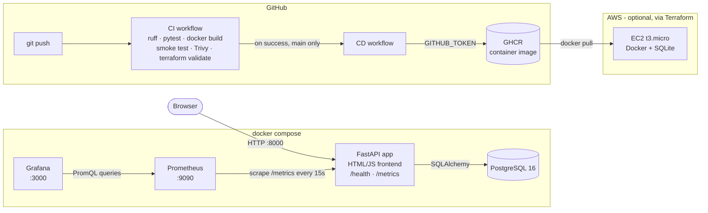

# 🎬 Movie Night

A small web app where a group suggests films, votes, and lets the app pick
tonight's movie — **weighted random by votes**. After the movie, everyone rates
it on a themed 1–5 scale (💩 → 🎞️💥) and leaves a short review.

The app is intentionally simple. The point of this project is the **DevOps
around it**: containers, CI/CD, security scanning, monitoring, and
infrastructure as code.

**Author:** Uday Charan Gopi · **License:** MIT


<!-- Replace OWNER with your GitHub username after the first push. -->

---

## Architecture



## Features

- Suggest movies (duplicates rejected, case-insensitive) — seeded with 20 classics
- Vote (one vote per person per movie, enforced by a database constraint)
- **Pick tonight's movie**: weighted random — 3 votes = 3× the chance of 1 vote
- Picked movies are marked watched and kept in a history
- **Rate & review** picked movies only, on a themed scale (stored as integers 1–5):

| Value | Symbol | Label | Animation (pure CSS, on hover + select) |
| --- | --- | --- | --- |
| 1 | 💩 | Crap | wobbles with little stink lines |
| 2 | 😴 | Boring | slowly bobs with floating z's |
| 3 | 🍿 | Fine | pops/bounces like popcorn |
| 4 | 🎬 | Great | clapperboard snaps shut |
| 5 | 🎞️💥 | Blew up | reel spins, then bursts |

  The average rating is shown with the matching symbol (rounded to the nearest
  step, e.g. 4.3 → 🎬 Great). Animations are switched off for users with
  `prefers-reduced-motion`.

## Quick start

### Option A: full stack with Docker (recommended)

```bash
docker compose up --build
```

| Service | URL | Notes |
| --- | --- | --- |
| App | http://localhost:8000 | API docs at `/docs` |
| Health | http://localhost:8000/health | `{"status":"ok","database":"ok"}` |
| Metrics | http://localhost:8000/metrics | Prometheus text format |
| Prometheus | http://localhost:9090 | Status → Targets shows `movie-night` UP |
| Grafana | http://localhost:3000 | `admin` / `admin` → Dashboards → Movie Night |

Passwords default to simple values for local use; copy `.env.example` to `.env`
to change them.

### Option B: just the app (no Docker)

```bash
python -m venv .venv && source .venv/bin/activate
pip install -r requirements-dev.txt
uvicorn app.main:app --reload       # uses SQLite: ./movienight.db
```

### Run the checks CI runs

```bash
ruff check . && ruff format --check .
pytest -v
```

## API

| Method | Path | What it does |
| --- | --- | --- |
| GET | `/health` | Liveness + database check (503 if DB is down) |
| GET | `/metrics` | Prometheus metrics |
| GET | `/api/movies` | List unwatched movies with vote counts (`?include_watched=true` for all) |
| POST | `/api/movies` | Suggest a movie `{"title", "year", "added_by"}` |
| POST | `/api/movies/{id}/vote` | Vote `{"voter"}` (409 if you already voted) |
| DELETE | `/api/movies/{id}/vote/{voter}` | Take a vote back |
| POST | `/api/pick` | Pick tonight's movie (weighted random) |
| GET | `/api/picks` | Pick history, newest first, with average rating + symbol |
| POST | `/api/picks/{pick_id}/reviews` | Review a pick `{"reviewer", "rating": 1-5, "comment"}` |
| GET | `/api/picks/{pick_id}/reviews` | Reviews + average rating + matching symbol |
| GET | `/api/rating-scale` | The 1–5 symbols and labels |

Reviews hang off a **pick**, not a movie, so "only picked movies can be
reviewed" is guaranteed by the data model: no pick → 404.

## What CI/CD does

**`.github/workflows/ci.yml`** — on every push and pull request:

1. **Lint & test**: `ruff check`, `ruff format --check`, `pytest` (40+ tests).
2. **Docker build & scan**: builds the image, runs it and curls `/health` and
   `/metrics` (smoke test), then scans it with **Trivy**. HIGH/CRITICAL are
   reported; a fixable CRITICAL fails the build.
3. **Terraform**: `terraform fmt -check` and `terraform validate` (no AWS
   credentials needed, nothing is applied).

**`.github/workflows/cd.yml`** — when CI succeeds on `main`, builds and pushes
`ghcr.io/<owner>/movie-night:latest` and `:sha-<short>` to GitHub Container
Registry using the built-in `GITHUB_TOKEN`. No secrets to configure.

> The Trivy action is pinned to a full commit SHA (v0.35.0) and Trivy itself
> to v0.69.3 — the versions Aqua Security confirmed safe after the March 2026
> supply-chain incident ([advisory](https://github.com/aquasecurity/trivy/security/advisories/GHSA-69fq-xp46-6x23)).

## Monitoring

Metrics exposed at `/metrics`:

| Metric | Type | Meaning |
| --- | --- | --- |
| `movienight_http_requests_total{method,path,status}` | Counter | Requests handled |
| `movienight_http_request_duration_seconds{method,path}` | Histogram | Latency (p50/p95 in Grafana) |
| `movienight_votes_cast_total` | Counter | Votes cast |
| `movienight_picks_made_total` | Counter | Movies picked |
| `movienight_reviews_submitted_total` | Counter | Reviews submitted |
| `movienight_movies_unwatched` | Gauge | Movies still waiting to be watched |

Grafana is **provisioned as code** (`monitoring/grafana/`): the Prometheus data
source and the *Movie Night* dashboard load automatically. Panels: totals for
votes / picks / reviews / unwatched / app up, requests per second by route,
latency p50/p95, votes-picks-reviews over time, and 4xx/5xx error rate.

### Screenshots

_Placeholders — see [`docs/screenshots/README.md`](docs/screenshots/README.md)
for what to capture._

- `docs/screenshots/app.png` — the app with votes, a pick and reviews
- `docs/screenshots/grafana-dashboard.png` — the Movie Night dashboard
- `docs/screenshots/prometheus-targets.png` — scrape target UP
- `docs/screenshots/github-actions.png` — green CI run

## Deploying to AWS (optional)

`infra/` contains Terraform for the cheapest sensible deploy: **one EC2
instance running the container** in the default VPC, with SSM Session Manager
instead of SSH, IMDSv2 required, and an encrypted disk.

```bash
cd infra
cp terraform.tfvars.example terraform.tfvars   # set container_image + allowed_cidr
terraform init
terraform plan
terraform apply      # creates real, billable resources
terraform destroy    # when you're done
```

Make the GHCR package public first (GitHub → Packages → movie-night → Package
settings) so EC2 can pull it without credentials.

### 💰 Cost note

- `t3.micro` is roughly **$7–8/month** on-demand in us-east-1 (Free Tier
  eligible on many new accounts), plus about **$2.40/month** for the 30 GB gp3
  disk and about **$3.60/month** for the public IPv4 address. Check the
  [AWS pricing page](https://aws.amazon.com/ec2/pricing/on-demand/) for current numbers.
- Deliberately avoided: load balancer, NAT gateway, RDS — each costs money
  every hour even with no traffic.
- **Run `terraform destroy` when you're done demoing.** Set an AWS Budget
  alert as a safety net.

## Design decisions

- **Clarity over cleverness.** Small files, one job each. The pick logic is a
  pure function (`app/picker.py`) with no web or DB code, so it's easy to test.
- **Postgres in Compose, SQLite fallback.** Same code via SQLAlchemy and
  `DATABASE_URL`. SQLite keeps tests fast and the AWS demo cheap.
- **Rules enforced in the database.** Unique constraints stop double votes and
  double reviews; a check constraint keeps ratings 1–5 even if someone bypasses
  the API.
- **Ratings stored as integers, displayed as symbols.** Averages and queries
  stay simple; the fun lives in one mapping (`app/ratings.py`) that the
  frontend reads from `/api/rating-scale`.
- **Route templates as metric labels** (`/api/movies/{movie_id}/vote`), not raw
  URLs, to avoid a Prometheus cardinality explosion.
- **Multi-stage, non-root Docker image** with a `HEALTHCHECK`.
- **Gate CD on CI** with `workflow_run`, and push the exact commit CI tested.
- **No migrations tool yet** — `create_all` at startup. Alembic would be the
  next step (see `docs/WALKTHROUGH.md`).

## Project layout

```
app/            FastAPI app, models, pick logic, metrics, rating scale, static frontend
tests/          pytest suite (picker, API, reviews, ratings, metrics)
monitoring/     Prometheus config + Grafana provisioning and dashboard JSON
infra/          Terraform for a single-EC2 AWS deploy (never applied by CI)
.github/        CI and CD workflows
docs/           WALKTHROUGH.md (how everything works + interview prep)
```

A full, plain-language tour of every file is in
[`docs/WALKTHROUGH.md`](docs/WALKTHROUGH.md).
